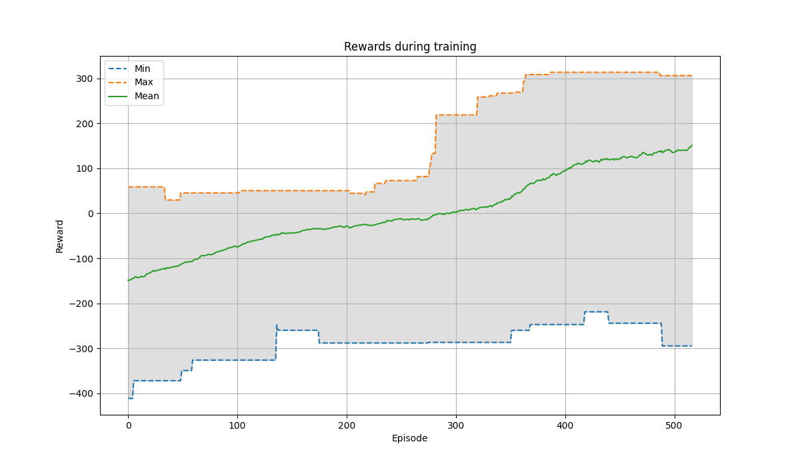

# Lunar-Landing

## Introduction

Git repo: https://github.com/Kamil-Sabbagh/Lunar-Landing

The lunar lander task involves safely landing a spacecraft on the moon's surface. The agent controls the spacecraft's main engine and side thrusters, and must manage its position, velocity, and orientation to achieve a safe landing within designated zones. We are interested in the continuous setting of this task, where the spacecraft has actions represented as real numbers between -1 and 1, one for the left or right orientation, and the other for throttle. You can learn more about the environment, its rewards, etc. [here](https://gymnasium.farama.org/environments/box2d/lunar_lander/).

In this repository, we experiment solving the lunar landing tasks with three different approaches: Actor Critic (AC), Asynchronous Advantage Actor-Critic (A3C), and Deep Deterministic Policy Gradient (DDPG). We also compare the training factors of the three models demonstrating such as the number of episodes (one run of the spacecraft from start to terminal state), and the number iterations (the number of steps taken by the spacecraft in a single episode). The results of trajectories are visualized in gif format.

## Setup

We provided a jupyter notebook for each approach in a separate directory. You can go the desired approach and run the following commands:

```
cd <algo-name>
```

```
python -m venv .venv
```

```
source .venv/bin/activate
```

```
pip install -r requirements.txt
```

Then open the notebook corresponding to the algorithm and run the cells.

## Results

### A3C rewards:



### DDPG rewards:


### Acrot-Cri rewards:


